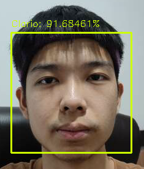
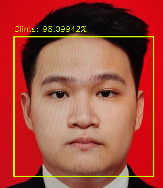
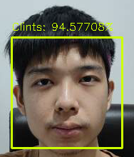

# FaceGSM

[](https://www.python.org/downloads/)
[](https://www.gnu.org/licenses/agpl-3.0)

<p align="center">
    
</p>

<p align="center">
    <b>
        Targeted Adversarial Attack using FGSM Method in Facial Recognition Embedding Model
    </b>
</p>

<p align="center">
    <a href="https://facegsm.gitbook.io/facegsm-documentation/facegsm/">
        Usage Guide
    </a> •
    <a href="#credits">
        Contributors
    </a> •
    <a href="#quick-start">
        Quick Start
    </a> 
</p>

**FaceGSM** designed for performing **targeted adversarial attacks** using the **FGSM (Fast Gradient Sign Method)** in **Facial Recognition Embedding Model**. FaceGSM revolutionizes security testing with a suite of innovative features, including:

-   **Static** - Takes **static images** as input for FaceGSM.
-   **Capture** - Takes image **captured** by camera as input for FaceGSM
-   **Live** - Takes **real-time** live video feed frames as input for FaceGSM.

<center>
<table>
    <tr>
        <td align="center" width="300" height="20">
            <b>Attacker's Face <br> (Clario)</b>
        </td>
        <td align="center" width="300" height="20">
            <b>Target's Face <br> (Clints)</b>
        </td>
        <td align="center" width="300" height="20">
            <b>Output : <br> Generated Adversarial Image</b>
        </td>
        <td align="center" width="300" height="20">
            <b>Attack Result : <br> Attacker's Face Predicted as Victim</b>
        </td>
    </tr>
    <tr>
        <td align="center" width="500">
            
        </td>
        <td align="center" width="500">
            
        </td>
        <td align="center" width="500">
            
        </td>
        <td align="center" width="500">
            
        </td>
    </tr>
</table>
</center>

# [🔑] Key Features

✅ Fully compatible with **multiple facial recognition embedding model** including [FaceNet](https://github.com/davidsandberg/facenet) and [ArcFace](https://insightface.ai/arcface)<br>
✅ Supports **multiple input media**, including static image, captured image and live video feed<br>
✅ Saved generated adversarial image as **checkpoints** to increase efficiency for future attacks<br>
✅ Works with your own **Custom Face Datasets**<br>
✅ Provide **easy** installation and **intuitive** UI/UX<br>

# [⚙️] Installation

## Conda Environment

Install Conda from [here](https://docs.anaconda.com/miniconda/miniconda-install/). After installing Conda, Run the following commands :

```bash
# Install anaconda-client if you don't already have it
$ conda install anaconda-client

# Create the environment for FaceGSM
$ conda env create facegsmproject/facegsm

# Activate the FaceGSM environment
$ conda activate facegsm
```

## Clone the Repository

```bash
# Clone the FaceGSM repository
$ git clone https://github.com/facegsmproject/FaceGSM
```

For more detail about the installation, please refer to our [Installation Guide](https://facegsm.gitbook.io/facegsm-documentation/facegsm/installation)

# [⌛] Quick Start

To test if FaceGSM is working properly you can use FaceGSM's default datasets and run the following command:

```bash
$ python3 facegsm.py static --original ./datasets/04.jpg --target ./datasets/74.jpg
```

## Help

```
$ python3 facegsm.py --help

Usage: python3 facegsm.py [ static | capture | live | database ] --help
Options:
  static: Static input for FGSM attack in FaceGSM.
  capture: Capture original and target photos in FaceGSM.
  live: Live camera feature in FaceGSM includes real-time face recognition and attack capabilities.
  database: Create a database based on datasets for FaceGSM.
  --help: Show help for available options.
```

## Custom Face Datasets

Generate your own custom face datasets by running the following command:

```bash
$ python3 facegsm.py database --dataset ./your_custom_dataset_folder
```

Run FaceGSM with your custom face datasets:

```bash
$ python3 facegsm.py static --original ./your_custom_dataset_folder/a.jpg --target ./your_custom_dataset_folder/b.jpg
```

# Credits

FaceGSM is developed by :

-   [Excy](https://github.com/Excillius)
-   [Fejka](https://github.com/clariojohan)
-   [Maskirovka](https://github.com/delbertgiovanni)
