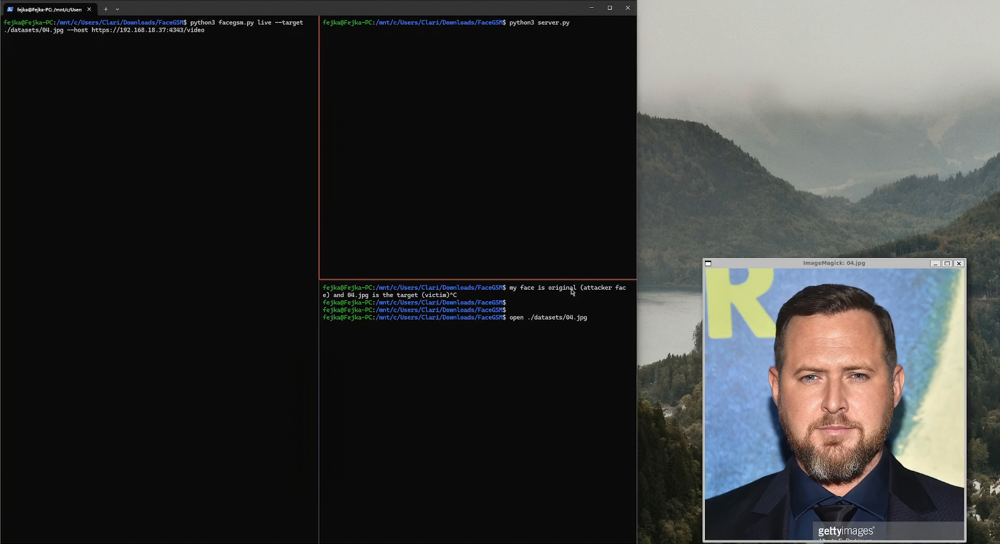

<center> <h1> FaceGSM </h1> </center>

# Table of Contents <!-- omit from toc -->

-   [FaceGSM](#facegsm)
-   [Live Camera Mode - Demo Video](#live-camera-mode---demo-video)
-   [Installation](#installation)
    -   [Environment Setup and Dependencies Installation](#environment-setup-and-dependencies-installation)
        -   [Computer Specifications and Software Versions used for Development](#computer-specifications-and-software-versions-used-for-development)
        -   [\*Requirements for Windows Users](#requirements-for-windows-users)
        -   [1. Clone the Repository](#1-clone-the-repository)
        -   [2. Python Environment](#2-python-environment)
            -   [Conda Environment Setup](#conda-environment-setup)
        -   [3. Installing Required Packages](#3-installing-required-packages)
-   [Features and Usage Guide](#features-and-usage-guide)
    -   [Quick Start](#quick-start)
    -   [Model Options](#model-options)
    -   [Database Generator](#database-generator)
    -   [Checkpoint Options](#checkpoint-options)
    -   [Manual Mode](#manual-mode)
    -   [Camera Capture Mode](#camera-capture-mode)
    -   [Live Camera Mode](#live-camera-mode)
        -   [Running Live Camera Mode](#running-live-camera-mode)
        -   [Face Recognition Mode](#face-recognition-mode)
        -   [Attack Mode](#attack-mode)
    -   [Credits](#credits)

# FaceGSM

FaceGSM is an open source penetration testing tool that automates the FGSM adversarial attack on the FaceNet model. It comes with three main modes such as manual mode, live mode, and camera mode. Additionally, we have implement some features to improve FaceGSM's efficiency including checkpoints feature and database generator feature.

# Live Camera Mode - Demo Video

[](https://drive.google.com/file/d/1uMBreIg1snWARdIuul-TwD2hyB01fIIi/view?usp=sharing)

# Installation

## Environment Setup and Dependencies Installation

### Computer Specifications and Software Versions used for Development

FaceGSM is developed using the following computer specifications and software versions:

-   **Operating System**: Windows 11 (64-bit) with WSL2 (Ubuntu 22.04.3 LTS)
-   **CPU**: Ryzen 5 7500F
-   **GPU**: NVIDIA GeForce RTX 4060
-   **Cuda Version**: 12.4
-   **GPU Driver Version**: 552.22
-   **Tensorflow Version**: 2.15.0

### \*Requirements for Windows Users

For `Windows` with GPU support, the user can use WSL2 for TensorFlow GPU support. The user can follow the instructions [here](https://www.tensorflow.org/install/pip#windows-wsl2). After succesfully installing WSL2, the user can follow the same instructions below.

### 1. Clone the Repository

<!-- The user can download FaceGSM by cloning the [FaceGSM]() repository: -->

_\*disclaimer: product is still in development, please clone from dev branch by using this command_

```bash
git clone --single-branch --branch dev https://github.com/hahahohocorp/FaceGSM.git
```

### 2. Python Environment

Create a python environtment using [Python 3.10.11](https://www.python.org/downloads/) (recommended to use [Conda](https://docs.conda.io/en/latest/miniconda.html)). Alternatively, the user can use the default Python environment on your system.

#### Conda Environment Setup

After successfully installing Conda, the user can create a new environment using the following command:

```bash
conda create -n facegsm python=3.10.11
```

Activate the environment using the following command:

```bash
conda activate facegsm
```

### 3. Installing Required Packages

After creating the environment, the user can install the required packages using the following command:

```bash
pip install -r requirements.txt
```

# Features and Usage Guide

## Quick Start

```bash
python3 facegsm.py manual --original original.jpg --target target.jpg --model /path/to/model/model.h5 --dataset /path/to/dataset/folder --checkpoint
```

To get a list of basic features and options use:

```bash
$ python3 facegsm.py --help

Usage: python3 facegsm.py live/camera/manual/--help
Options:
  live: Live camera feature in FaceGSM includes real-time face recognition and attack capabilities.
  camera: Camer original and target photos in FaceGSM.
  manual: Manual input for FGSM attack in FaceGSM.
  --help: Show help for available options.
```

FaceGSM has three main commands:

-   manual - Manual input for FGSM attack in FaceGSM.
-   camera - Camera capture for original and target photos in FaceGSM.
-   live - Live camera feature in FaceGSM includes real-time face recognition and attack capabilities.

## Model Options

By default, FaceGSM have a default model from _facenet_ that have been trained with _VGGFace2_. The _facenet_ model receives an input dimension of 160 x 160 pixels and outputing 128 `embeddings vector`. However, user can use their own facenet model using `--models` options.

_\*Disclaimer: FaceGSM currently only supports facenet model. FaceGSM use default facenet model trained using VGGFace2, but user can use their own facenet model trained by custom datasets_

## Database Generator

FaceGSM use default datasets which are randomly picked 100 faces from VGGFace2 datasets. However, User can use their own dataset folder using `--datasets` options. FaceGSM then will generate a JSON database file containing _embeddings vector_ of each faces using the model.

## Checkpoint Options

FaceGSM also have `checkpoint` feature. Checkpoint is a feature that allows the user to save perturbed layer in `.ckpt` file which can be used to continue the attack process without the need to re-run the attack process from the beginning.

Example of `checkpoint` scenario:

1. User run any mode
2. FaceGSM automatically save the perturbed layer in `.ckpt` file if :
    1. User stop the attack process in the middle of the process (using prompt)
    2. Full attack process is completed
3. The next time user run the attack using the `same original face and target face`, user can use the `.ckpt` file to continue the attack process without the need to re-run the attack process from the beginning.
4. If the user wants to change the `original face` or `target face`, the user needs to delete the `.ckpt` file to start the attack process from the beginning. Because different `original face` or `target face` will generate different perturbed layer.

_Notes : Any output generated by FaceGSM will be stored in `output` folder._

## Manual Mode

Manual mode allows the user to specify `original face` and `target face` in static images format such as `.jpg` and `.png`. The user can use the following command to run the manual mode:

```bash
python3 facegsm.py manual --original ./path/to/original.png --target ./path/to/target.png
```

## Camera Capture Mode

Camera capture mode allows the user to capture the `attacker original's face` and the `target victim's face` using `camera`. The user can use the following command to run the camera capture mode:

```bash
python3 facegsm.py camera --host [ip_droidcam]

# Example:
# python3 facegsm.py camera --host http://192.168.1.3:4747/video
# python3 facegsm.py camera --host https://172.22.1.2:4343/video
```

_Disclaimer: This mode requires a third-party application called [DroidCam](https://play.google.com/store/apps/details?id=com.dev47apps.droidcam&pcampaignid=web_share) which can only be installed on Android devices. FaceGSM will connect to the camera wirelessly via the DroidCam IP address on the user's smartphone._

## Live Camera Mode

The live camera mode in FaceGSM enables real-time adversarial attack FGSM. In this mode, FaceGSM will have two sub-modes, namely `Face Recognition mode` and `Attack mode`.

### Running Live Camera Mode

To be able to run live camera mode, first the user need to run `server.py`. Use the following command to run `server.py`:

```bash
python3 /app/server.py
# if the server is running correctly, the user will see the following output:
Server started...
```

After the server is running, the user can run FaceGSM `Live Camera Mode` using the following command:

```bash
python3 facegsm.py live --host [ip_droidcam] --target ./path/to/target.png
```

### Face Recognition Mode

`Face Recognition Mode` is the default sub-mode when running live camera mode. This mode will perform face recognition using the live camera feed and compare the detected faces with those in the database. If a match is found, the program will generate a prediction of the face and its similarity value. These results are displayed alongside the live camera feed.

### Attack Mode

While the `Face Recognition Mode` is running, the user can toogle the `Attack Mode` by pressing the `a` key from your keyboard. This mode will perform an targeted adversarial attack FGSM using the face detected by the live camera feed as the `Original Face` and the image path specified in the `--target` option as the `Target Face`.

_Notes: when the user wants to toogle the `Attack Mode` by pressing the `a` key, the user might need to press the key press multiple time until the facegsm.py program is outputing `Attacking : True`. This is because the used of async function in the program._

Guide to tools the `Attack Mode`:

1. Run `python3 server.py` in Terminal A
2. Run `python3 facegsm.py live --host [ip_droidcam] --target ./path/to/target.png` in Terminal B
3. Try to detect the face using the live camera feed
4. Click the live camera feed window
5. Press the `a` key to toogle the `Attack Mode` (multiple time / spam until Terminal B is outputing `Attacking : True`)
6. Don't forget to hold your camera steadily, pointed at the target's face while pressing the `a` key

## Credits

FaceGSM is developed by [Excy](), [Fejka](), and [Maskirovka]()
